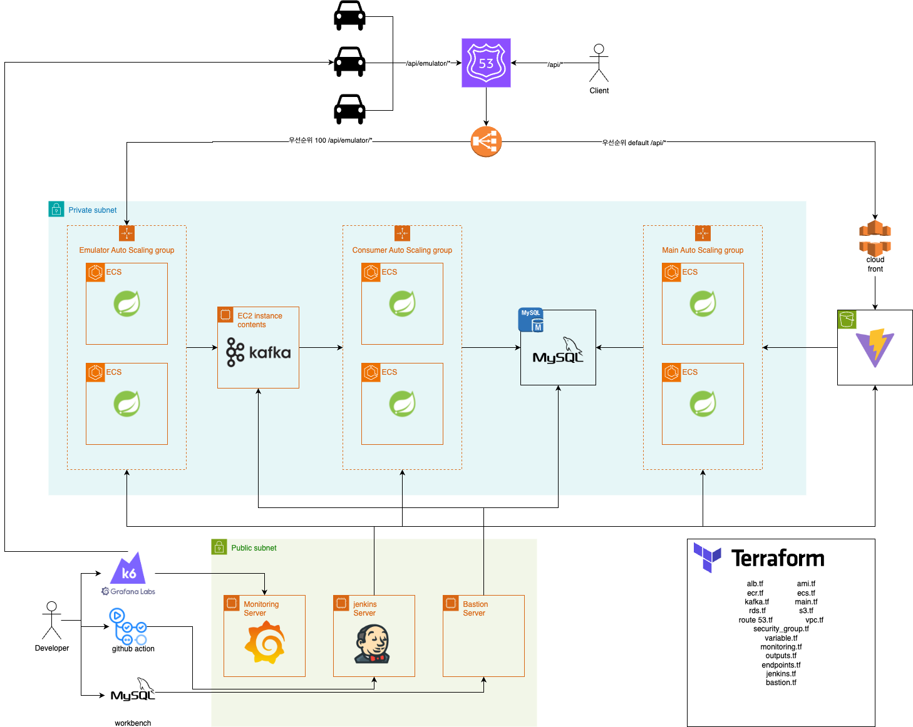
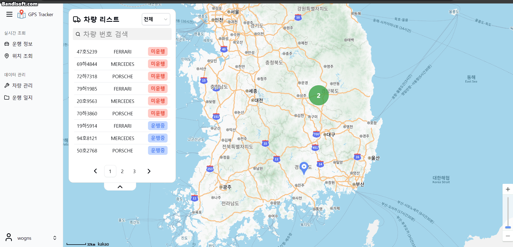
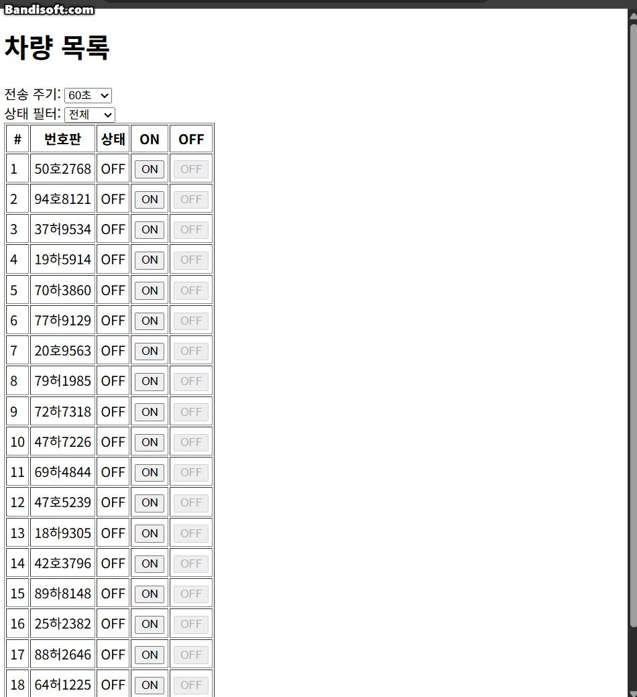
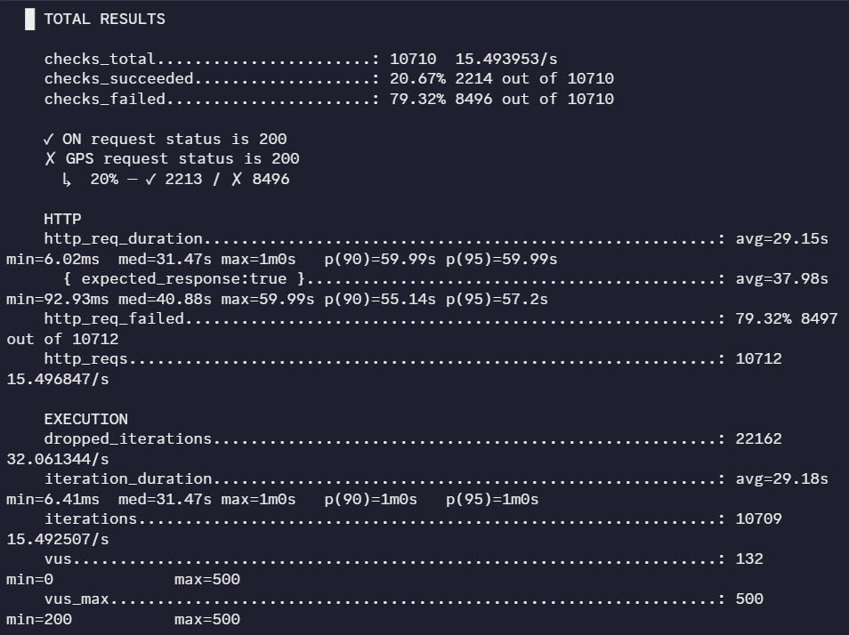
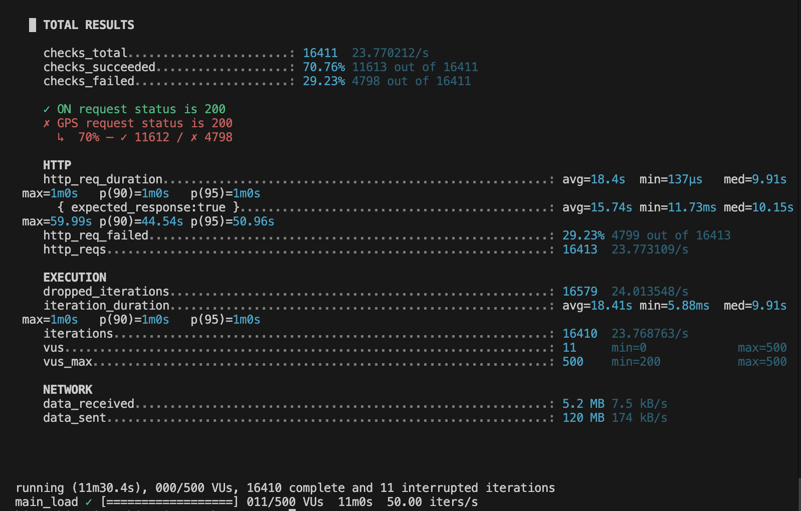

# 🚗 Real‑time GPS Tracking System (KUNI GPSTracker)

> 실시간 차량 위치 추적/모니터링 서비스. 에뮬레이터→Kafka→DB→백엔드→프런트 대시보드까지 **엔드투엔드 파이프라인**을 제공합니다.

---

## 1) 프로젝트 개요

- **목표**: 대량 차량의 위치 데이터를 실시간으로 수집/처리/시각화
- **핵심 기능**
  - 실시간 GPS 스트림 처리 (Kafka 기반)
  - 대시보드에서 차량 현황/주행 이력 확인
  - 최근 2분 기준 상태 판정 (주행/정지/오프라인)
- **특징**
  - 모놀리식이 아닌 *Main/Consumer/Emulator/Common* **멀티모듈**
  - **AWS ECS + ALB + S3/CloudFront + RDS + ECR** 프로덕션 배포
  - **Terraform**으로 인프라 IaC, **Jenkins**로 CI/CD

---

## 2) 기술 스택

- **Backend**: Java 17, Spring Boot 3, Spring Data JPA, WebFlux, Spring Security, JWT
- **Messaging**: Apache Kafka (Zookeeper)
- **DB/Cache**: MySQL (RDS)
- **Frontend**: React , TypeScript
- **Infra**: Terraform, AWS (ECS, ALB, S3/CloudFront, ECR, RDS, Route53, CloudWatch), Docker, Docker Compose
- **CI/CD**: Jenkins (멀티브랜치/파이프라인)


>      

---

## 3) 저장소 구조 (Monorepo)

```text
KUNI_GPSTracker/
├─ BackendServer/
│  ├─ common/            # 공용 엔티티/DTO/유틸
│  ├─ consumer/          # Kafka consumer
│  ├─ emulator/          # 에뮬레이터로부터 데이터 받는 서버
│  └─ server/            # 관제 서버 api
├─ Emulator/             # 애뮬레이터 기기
├─ infra/
│  ├─ terraform/         # AWS IaC
│  |─ Jenkinsfile        # CI/CD Jenkins 설정 파일
|  └─ Dockerfile         # 서버 이미지 도커 파일
└─ docs/
   └─ images/            # 아키텍처/스크린샷/GIF
```

---

### 4) 서버 아키텍처

>


---

## 5) 서비스 플로우 차트 (처리 파이프라인)

```mermaid
유빈이가 주는 걸로 교체
```

---

## 6) 실제 화면 (GIF/스크린샷)

> `docs/images/`에 파일을 두고 아래 경로를 수정하세요.

- 대시보드

  


- 차량 실시간

  


- 차량 관리

  

- 운행 일지

  

- 애뮬레이터

  

---

## 7) 빠른 시작 (로컬)

### 7-1. 사전 요구사항
- JDK 17
- MYSQL 8.0
- Docker / Docker Compose

### 7-2. 환경 변수 파일 추가

```bash
# BackendServer 공통 (루트/BackendServer/각 모듈의 루트/.env.properties)
DB_HOST=localhost
DB_PORT=3306
DB_NAME=gpsTracker
DB_USERNAME=root
DB_PASSWORD=password
KAFKA_BOOTSTRAP_SERVERS=localhost:9092

# Emulator용 (루트/Emulator/.env.properties)
TARGET_BASE_URL=http://localhost:8081/api/emulator
```

### 7-3. Docker Compose로 Mysql과 Kafka 실행

```bash
# 루트에서 실행
docker compose -f docker-compose.mysql.yaml up -d
docker compose -f docker-compose.kafka.yaml up -d
```

### 7-4. 개별 실행

```bash
# Backend는 BackendServer 폴더에서 실행
# Backend (main)
./gradlew :server:bootRun

# Backend (emulator(server))
./gradlew :emulator:bootRun

# Backend (Consumer)
./gradlew :consumer:bootRun

# Emulator 폴더에서 실행
./gradlew :bootRun
```

> Swagger UI: `http://localhost:8080/swagger-ui/index.html`
> emulator web: `http://localhost:8082/emulator`

---

## 8) 운영 배포 (요약)

1. Develop 브랜치 푸쉬 후 Jenkins에서 빌드
2. Terraform으로 인프라 변경 (필요 시)
3. CloudWatch Logs로 모니터링


---

## 9) 성능/확장성 (지표 예시)

- **Kafka 설정**: 예산 문제로 broker 1개로 진행
- **처리량**: 1분에 15000건의 요청, 한 요청당 60개 gps정보
- **ECS 오토스케일** (CPU 기반)

>kafka 적용 이전 (총 노트북 5대로 진행, 아래 예시는 1대)
>

>kafka 적용 이후
>

>성공률이 20% -> 70% 로 증가

---

## 10) 보안

- JWT 기반 인증
- CORS 허용 도메인 화이트리스트
- 비밀정보는 환경변수 사용
- HTTPS(CloudFront/ALB) 암호화 사용

---

## 11) 팀원 소개 (백엔드)

| 이름 | 역할 | 담당 | GitHub |
|---|---|---|---|
| 김재훈 | 백엔드 리드 | API/Kafka | [@id](https://github.com/kjh0work) |
| 장승훈 | 프런트엔드 | 대시보드/차트/지도 | [@id](https://github.com/Jang2019) |
| 백서연 | 인프라 | AWS/Terraform/CI-CD | [@id](https://github.com/synnbaek) |
| 김수현 | 인프라 | AWS/Terraform/CI-CD | [@id](https://github.com/sue3kim) |
| 김유빈 | 인프라 | AWS/Terraform/CI-CD | [@id](https://github.com/KimYooBin1) |


