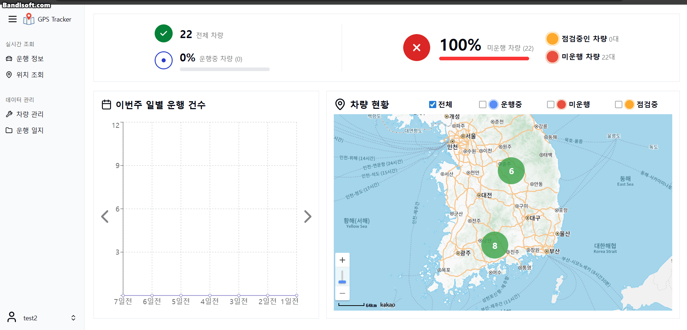
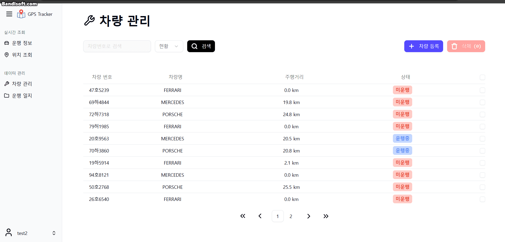
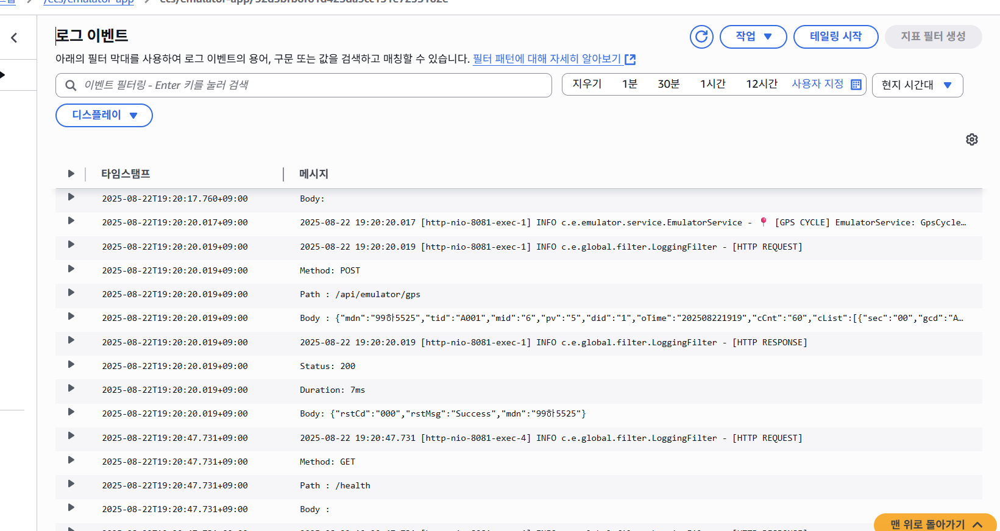

# 🚗 Real‑time GPS Tracking System (KUNI GPSTracker)

> 실시간 차량 위치 추적/모니터링 서비스. 에뮬레이터→Kafka→DB→백엔드→프런트 대시보드까지 **엔드투엔드 파이프라인**을 제공합니다.

---

## 1) 프로젝트 개요

- **목표**: 대량 차량의 위치 데이터를 실시간으로 수집/처리/시각화
- **핵심 기능**
  - 실시간 GPS 스트림 처리 (Kafka 기반)
  - 대시보드에서 차량 현황/주행 이력 확인
  - 최근 2분 기준 상태 판정 (주행/정지/오프라인)
- **특징**
  - 모놀리식이 아닌 *Main/Consumer/Emulator/Support* **멀티모듈**
  - **AWS ECS + ALB + S3/CloudFront + RDS + ECR** 프로덕션 배포
  - **Terraform**으로 인프라 IaC, **Jenkins**로 CI/CD

---

## 2) 기술 스택

- **Backend**: Java 17, Spring Boot 3, Spring Data JPA, WebFlux, Spring Security, JWT
- **Messaging**: Apache Kafka (Zookeeper)
- **DB/Cache**: MySQL (RDS)
- **Frontend**: React , TypeScript
- **Infra**: Terraform, AWS (ECS, ALB, S3/CloudFront, ECR, RDS, Route53, CloudWatch), Docker, Docker Compose
- **CI/CD**: Jenkins (멀티브랜치/파이프라인)


>      

---

## 3) 저장소 구조 (Monorepo)

```text
KUNI_GPSTracker/
├─ BackendServer/
│  ├─ consumer/          # Kafka consumer
│  ├─ emulator/          # 에뮬레이터로부터 데이터 받는 서버
│  ├─ server/            # 관제 서버 api
│  └─ support/           
|     ├─ common/         # Util
|     ├─ business/       # Record 관련 DTO
|     ├─ database/       # DB
|     ├─ global/         # swagger, exception, kafka 모델
│     └─ log/            # log 관련 설정
├─ Emulator/             # 애뮬레이터 기기
├─ infra/
│  ├─ terraform/         # AWS IaC
│  |─ Jenkinsfile        # CI/CD Jenkins 설정 파일
|  └─ Dockerfile         # 서버 이미지 도커 파일
└─ docs/
   └─ images/            # 아키텍처/스크린샷/GIF
```

---

### 4) 서버 아키텍처

>


---

## 5) 서비스 플로우 차트 (처리 파이프라인)

```mermaid

flowchart TD
    %% ------------------ 사용자 영역 ------------------
    subgraph USER[사용자]
        direction TB
        A1["👤 렌터카 업체 관리자"]
        A2["📝 차량 등록/삭제"]
        A3["🧑‍💼 운전자 정보 입력"]
    end

    %% ------------------ Emulator 서버 ------------------
    subgraph EMULATOR_SERVER[Emulator 서버]
        direction TB
        B1["🛠️ Emulator API"]
        B2["/api/emulator/token - 토큰 발급"]
        B3["/api/emulator/on - 시동 ON"]
        B4["/api/emulator/off - 시동 OFF"]
        B5["/api/emulator/gps - GPS 주기정보 저장 (CSV 수신)"]
        B6["Kafka Producer"]
    end

    %% ------------------ Kafka & DB ------------------
    subgraph KAFKA_DB[Kafka & DB]
        direction TB
        C1["🧱 Kafka Broker (1분당 15,000건)"]
        C2["📥 Kafka Consumer"]
        C3["🗄️ MySQL RDS"]
        C4["📌 Vehicle"]
        C5["📍 Device"]
        C6["🧾 Record"]
        C7["📡 GpsRecord"]
    end

    %% ------------------ BackendServer ------------------
    subgraph BACKEND[BackendServer API]
        direction TB
        D1["🔧 BackendServer API"]
        D2["/vehicles - 차량 목록"]
        D3["/location - 실시간 위치"]
        D4["/dashboard - 운행 통계"]
        D5["/api/emulator - Emulator 이벤트 처리"]
    end

    %% ------------------ React Frontend ------------------
    subgraph FRONTEND[React 대시보드]
        direction TB
        E1["💻 React 대시보드"]
        E2["🔐 로그인/회원가입"]
        E3["📊 전체 차량 현황"]
        E4["🗺️ 실시간 위치 지도"]
        E5["🧾 운행 일지 페이지"]
        E6["🔍 차량 관리 페이지"]
        E7["📌 개별 차량 상세 페이지"]
        E8["⏱️ 15초 간격 데이터 fetch"]
    end

    %% ------------------ 인프라 ------------------
    subgraph INFRA[인프라 구성]
        direction TB
        F1["☁️ AWS ECS + ALB"]
        F2["🗂️ S3 + CloudFront"]
        F3["🐳 ECR + RDS"]
        F4["🛠️ Terraform + Jenkins"]
        F5["📈 CloudWatch Logs"]
    end

    %% ------------------ 연결 ------------------
    %% 사용자 → BackendServer
    A1 --> A2
    A2 --> D2
    A3 --> D2

    %% Emulator 서버 API
    B1 --> B2
    B1 --> B3
    B1 --> B4
    B1 --> B5
    B5 --> B6

    %% Kafka → DB
    B6 --> C1
    C1 --> C2
    C2 --> C7

    %% DB 관계
    C4 --> C5
    C4 --> C6
    C4 --> C7
    C6 --> C7

    %% BackendServer API ↔ DB
    D1 --> D2
    D1 --> D3
    D1 --> D4
    D1 --> D5

    D2 --> C4
    D2 --> C5
    D3 --> C7
    D4 --> C4
    D4 --> C6
    D4 --> C7
    D5 --> C7

    %% React Frontend ↔ BackendServer API
    E2 --> D1
    E6 --> D2
    E5 --> D4
    E4 --> D3
    E3 --> D4
    E5 --> E7
    E8 --> D2
    E8 --> D3
    E8 --> D4

    %% 인프라 연결
    F1 --> D1
    F2 --> E2
    F3 --> C3
    F4 --> F1
    F5 --> F1



```



## 6) 실제 화면 (GIF/스크린샷)

- 대시보드

  


- 차량 실시간

  


- 차량 관리

  

- 운행 일지

  

- 애뮬레이터

  

- AWS Cloud Watch Log

  

---

## 7) 빠른 시작 (로컬)

### 7-1. 사전 요구사항
- JDK 17
- MYSQL 8.0
- Docker / Docker Compose

### 7-2. 환경 변수 파일 추가

```bash
# BackendServer 공통 (루트/BackendServer/.env.properties)
DB_HOST=localhost
DB_PORT=3306
DB_NAME=gpsTracker
DB_USERNAME=root
DB_PASSWORD=password
KAFKA_BOOTSTRAP_SERVERS=localhost:9092
jwt.secret=very-secret-key-very-secret-key-123456
jwt.secret-base64=SFVGjDe/OwyN46p1euKSNQvZrpF14kwEKI9kUJ50BvI=

# Emulator용 (루트/Emulator/.env.properties)
TARGET_BASE_URL=http://localhost:8081/api/emulator
```

### 7-3. Docker Compose로 Mysql과 Kafka 실행

```bash
# 루트에서 실행
docker compose -f docker-compose.mysql.yaml up -d
docker compose -f docker-compose.kafka.yaml up -d
```

### 7-4. 개별 실행

```bash
# Backend는 BackendServer 폴더에서 실행
# Backend (main)
./gradlew :server:bootRun

# Backend (emulator(server))
./gradlew :emulator:bootRun

# Backend (Consumer)
./gradlew :consumer:bootRun

# Emulator 폴더에서 실행
./gradlew :bootRun
```

> Swagger UI: `http://localhost:8080/swagger-ui/index.html`
> emulator web: `http://localhost:8082/emulator`

---

## 8) 운영 배포 (요약)

1. Develop 브랜치 푸쉬 후 Jenkins에서 빌드
2. Terraform으로 인프라 변경 (필요 시)
3. CloudWatch Logs로 모니터링


---

## 9) 성능/확장성 (지표 예시)

- **Kafka 설정**: 예산 문제로 broker 1개로 진행
- **처리량**: 1분에 15000건의 요청, 한 요청당 60개 gps정보
- **ECS 오토스케일** (CPU 기반)

>kafka 적용 이전 (총 노트북 5대로 진행, 아래 예시는 1대)
>

>kafka 적용 이후
>

>성공률이 20% -> 70% 로 증가

---

## 10) 보안

- JWT 기반 인증
- CORS 허용 도메인 화이트리스트
- 비밀정보는 환경변수 사용
- HTTPS(CloudFront/ALB) 암호화 사용

---

## 11) 팀원 소개 (백엔드)

| 이름 | 역할 | 담당 | GitHub |
|---|---|---|---|
| 김재훈 | 백엔드 리드 | API/Kafka | [@id](https://github.com/kjh0work) |
| 장승훈 | 인프라 | AWS/Terraform/CI-CD | [@id](https://github.com/Jang2019) |
| 백서연 | 인프라 | AWS/Terraform/CI-CD | [@id](https://github.com/synnbaek) |
| 김수현 | 인프라 | AWS/Terraform/CI-CD | [@id](https://github.com/sue3kim) |
| 김유빈 | 인프라 | AWS/Terraform/CI-CD | [@id](https://github.com/KimYooBin1) |


